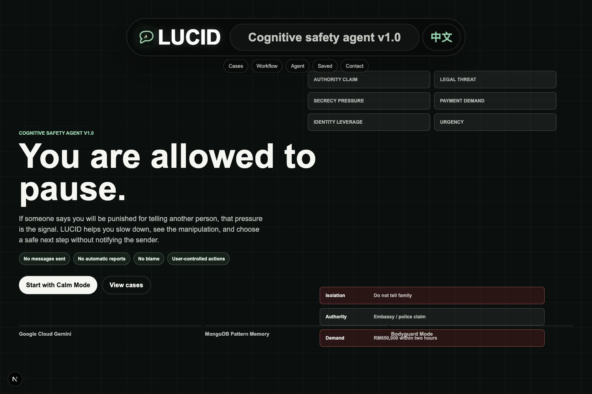
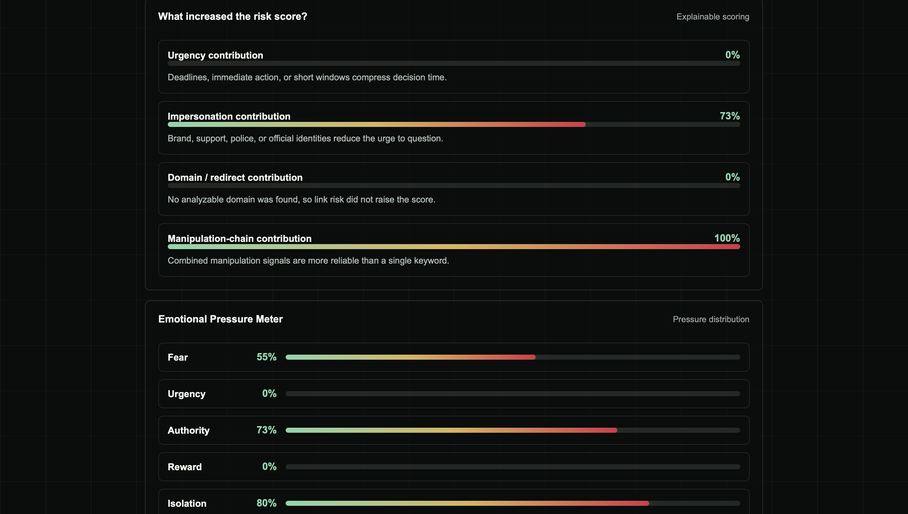

# LUCID

## Live Demo

Try LUCID on Google Cloud Run:

https://lucid-cognitive-triage-agent-220940600627.us-central1.run.app

## Product Demo

### Pause-first cognitive safety experience



### Explainable evidence and emotional-pressure signals



## Why LUCID?

### The Story Behind LUCID

LUCID was born from a real incident that happened to someone close to me.

A few months ago, one of my friends received a scam message pretending to be from an embassy. The scammer claimed that my friend was involved in a serious criminal case — allegedly forcing someone to commit suicide — and demanded a large "security deposit" of 600,000 RMB to avoid imprisonment.

At first, my friend had doubts. However, the scammers made the situation extremely convincing by providing personal information, including family details and identity-related data. Facing a high-pressure threat combined with the exposure of private information, my friend began to panic.

This experience made me realize something important:

> People are usually rational, but fear and psychological pressure can temporarily disrupt our ability to make rational decisions.

When someone is threatened, their brain naturally enters a survival response. In that moment, they may not need more information — they need a system that helps them slow down, evaluate risks, and return to a rational state.

### Building an AI Agent for Rational Decision-Making

This became the motivation behind LUCID.

I wanted to build an AI agent that could act as a "digital safety layer" between humans and potential scams:

- Automatically analyze suspicious messages, screenshots, URLs, and conversations.
- Estimate the probability of fraud through a quantified scam risk score.
- Provide clear explanations instead of simply saying "this is a scam."
- Help users regain control and make decisions based on evidence rather than fear.

However, security was the first principle of LUCID.

A tool designed to protect users should never become another source of privacy risk. Therefore, LUCID was designed with privacy and safety as core requirements, minimizing unnecessary data exposure while providing intelligent risk assessment.

LUCID is not just a scam detection system.

It is an AI agent designed to help people pause, think clearly, and regain rational judgment when facing manipulation.

**Cognitive Safety Agent for the Moment Before Harm Happens**

LUCID is a Google Cloud Rapid Agent Hackathon project that helps people pause, understand scam pressure, and choose a safer next step before panic-driven decisions. It analyzes user-submitted screenshots, URLs, call transcripts, or pasted messages; detects manipulation chains; retrieves similar anonymized patterns from MongoDB Pattern Memory; and generates user-controlled safety actions.

LUCID is not a fraud verdict engine. It is a cognitive triage agent for the moment when a scammer is trying to isolate the user, rush the user, or make the user too afraid to verify.

## What It Does

- Accepts up to five user-submitted screenshots plus optional URL or text context.
- Uses Gemini for multimodal scam and manipulation analysis.
- Detects pressure tactics such as fear, urgency, authority impersonation, isolation, greed, account threats, suspicious links, and sensitive-data demands.
- Uses four-level cognitive triage: `Green`, `Yellow`, `Orange`, `Red`.
- Activates protective guidance for `Orange` or `Red` cases.
- Retrieves similar anonymized scam patterns from MongoDB Pattern Memory.
- Generates safe replies, verification steps, evidence summaries, shareable reports, and optional anonymized pattern records.
- Falls back to stable demo data if external API keys are not configured, so the demo remains reliable.

## Agent Workflow

LUCID runs a user-controlled agent workflow:

1. **Perceive evidence**: Gemini reads user-submitted screenshots, URLs, call transcripts, or pasted text.
2. **Retrieve memory**: MongoDB Pattern Memory searches `patterns` and `cases` for similar anonymized manipulation structures.
3. **Reason and triage**: LUCID combines Gemini output, retrieved patterns, and calibration rules to assign a risk level.
4. **Recommend safe action**: the agent generates calm next steps, safe replies, verification guidance, and a trusted-person report.
5. **Act only with oversight**: the user decides whether to save, share, copy, or ignore anything.
6. **Optional memory update**: with explicit confirmation, LUCID saves only an anonymized pattern, not the original private chat.

## Google Cloud and Partner Integration

LUCID is built for the Google Cloud Rapid Agent Hackathon stack:

- **Google Cloud Gemini** performs multimodal reasoning over screenshots, URLs, and text.
- **Google Cloud Run** hosts the public web agent.
- **MongoDB Atlas** stores Pattern Memory collections.
- **MongoDB MCP-compatible tooling** provides the partner tool concept for memory retrieval and anonymized pattern saving.

The app runtime currently uses the MongoDB Node.js driver for production reliability, while the agent architecture and submission materials map the same collections to MongoDB MCP tools. See [`docs/agent-builder-mcp.md`](docs/agent-builder-mcp.md) for the Agent Builder / MCP architecture and tool mapping.

### MongoDB Pattern Memory Collections

- `patterns`: curated anonymized scam patterns.
- `cases`: user-confirmed anonymized patterns saved from the app.
- `feedback`: optional future collection for quality review.

### MCP Tool Mapping

- `search_patterns`: retrieves similar patterns from `patterns` and `cases`.
- `save_anonymized_pattern`: saves only abstracted risk type, manipulation chain, evidence phrases, and safe actions after user confirmation.

## Tech Stack

- Next.js + TypeScript
- Google Cloud Gemini API
- Google Cloud Run
- MongoDB Atlas / MongoDB Pattern Memory
- Docker + Cloud Build

## Local Setup

Install dependencies:

```bash
npm install
```

Copy environment variables:

```bash
cp .env.example .env
```

Fill `.env`:

```bash
GOOGLE_API_KEY=your_gemini_api_key
GOOGLE_API_MODE=vertex_express
GOOGLE_MODEL=gemini-2.5-flash
GOOGLE_CLOUD_PROJECT=your_google_cloud_project
GOOGLE_CLOUD_LOCATION=us-central1
MONGODB_URI=your_mongodb_connection_string
MONGODB_DB=lucid
```

Run locally:

```bash
npm run dev
```

Open:

```text
http://localhost:3000
```

If port 3000 is occupied, Next.js may use `http://localhost:3001`.

## Fallback Mode

If `GOOGLE_API_KEY` is missing or Gemini returns invalid JSON, LUCID returns stable built-in demo analysis.

If `MONGODB_URI` is missing or MongoDB fails, LUCID searches a local anonymized sample pattern list.

This is intentional for hackathon reliability, but the public demo should be run with Gemini and MongoDB configured when possible.

## Demo Cases

The app includes privacy-safe synthetic demo cases:

- Low-risk IG check-in: ordinary scheduling, should stay Green.
- Airline refund phishing: phone call plus fake compensation website.
- Fake police / embassy threat: authority, fear, isolation, and payment pressure.
- WhatsApp account phishing: account-ban pressure plus suspicious links.
- Crypto investment hype: fake new-token launch pressure, countdown, unverifiable returns, and buy/recharge prompts.

Demo screenshots live in `public/cases/`.

## Privacy and Safety Boundaries

- LUCID analyzes only content the user actively submits.
- It does not read SMS, WhatsApp, Gmail, browser tabs, or bank accounts.
- It does not send messages, report users, freeze accounts, or execute financial actions.
- User-submitted content may temporarily pass through the backend and Gemini for analysis.
- LUCID is not described as fully private or end-to-end encrypted.
- Saved local reviews stay in browser local storage.
- Optional anonymized pattern saving requires user confirmation.
- Anonymized patterns should contain only risk type, manipulation chain, short evidence phrases, risk level, and recommended actions.
- Original screenshots, full private chats, names, accounts, and contact details should not be saved as pattern memory.
- Evidence summaries are not legal documents.

## Devpost Short Description

LUCID is a cognitive safety agent for the moment before harm happens. It uses Gemini to analyze scam pressure in screenshots, call transcripts, URLs, and messages, retrieves similar anonymized manipulation patterns from MongoDB Pattern Memory, and helps users pause, verify, and choose safer next actions without notifying the sender.

## Deployment

Recommended deployment target: **Google Cloud Run**.

See [`DEPLOYMENT.md`](DEPLOYMENT.md) for Docker and Cloud Build commands.

Required environment variables:

- `GOOGLE_API_KEY`
- `GOOGLE_API_MODE`
- `GOOGLE_MODEL`
- `GOOGLE_CLOUD_PROJECT`
- `GOOGLE_CLOUD_LOCATION`
- `MONGODB_URI`
- `MONGODB_DB`

## License

MIT
